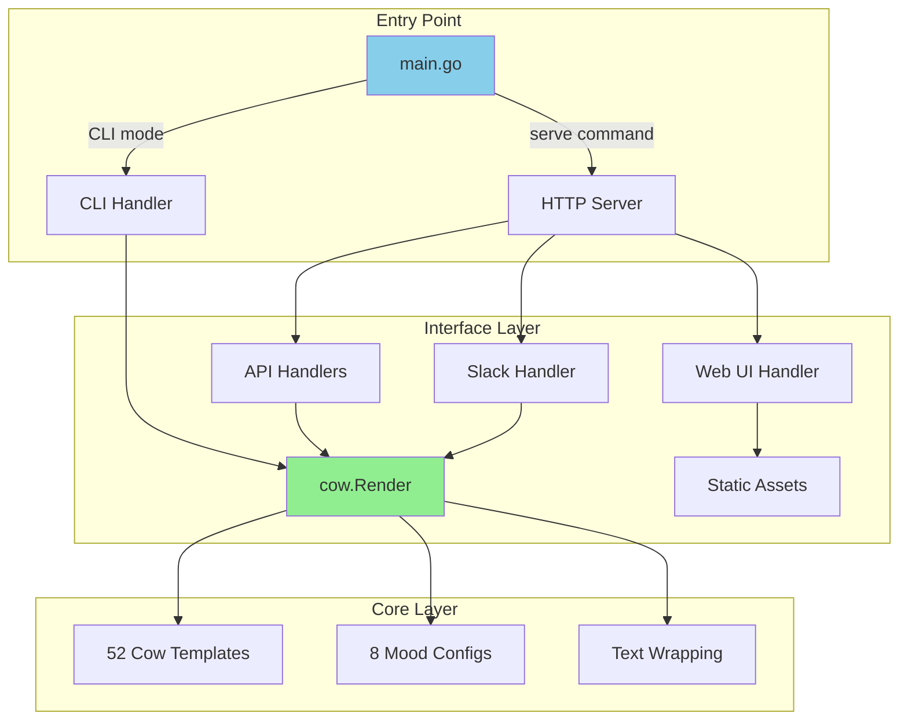
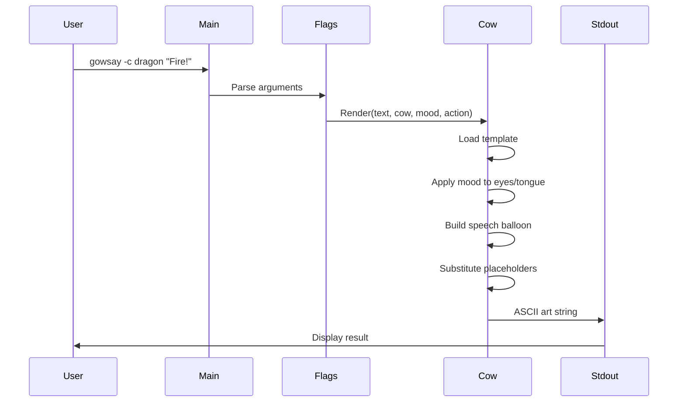
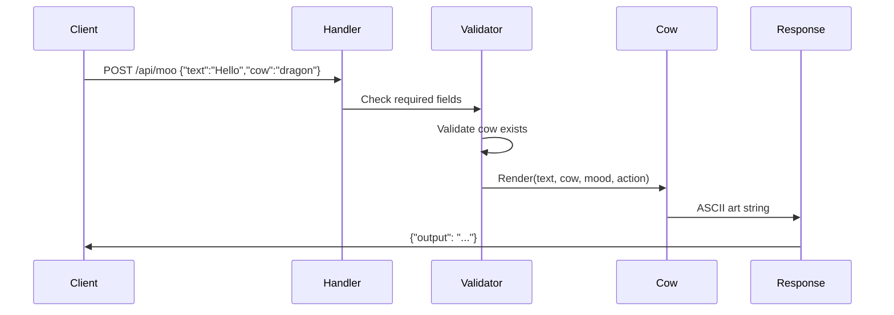

# Building a Modern Cowsay: One Binary, Three Interfaces

## Introduction

Cowsay has been a Unix staple since 1999—a simple program that makes ASCII cows say things. While the original Perl implementation works fine, modern deployment environments often need different interfaces: a CLI for terminal use, an HTTP API for integrations, and a web UI for accessibility.

This article examines the design and implementation of gowsay, a Go reimplementation that provides all three interfaces in a single statically-linked binary. We'll explore the architectural decisions, implementation patterns, and practical tradeoffs involved in building a focused, maintainable tool.

**What We Built**: A 10MB binary that functions as:
- A command-line tool with pipe support and flag parsing
- A REST API server with JSON endpoints
- A web interface with embedded assets
- A Slack integration endpoint

**Why It Matters**: The design demonstrates how to structure a multi-interface Go application without frameworks, abstraction layers, or complex configuration management.

## Problem Space

The original cowsay implementation has limitations in modern environments:

1. **Deployment**: Perl script + separate cow files requires coordinated deployment
2. **Integration**: No HTTP API, limiting programmatic access
3. **Accessibility**: Terminal-only, no web interface for non-technical users
4. **Configuration**: Hard to package for cloud deployment (Lambda, container registries)

We needed a solution that:
- Deploys as a single artifact
- Works identically across platforms (Linux, macOS, Windows)
- Provides multiple interfaces without code duplication
- Maintains the simplicity of the original

## Architecture Overview

The system follows a three-layer design:



### Package Structure

```
gowsay/
├── main.go          # Entry point and routing
├── cow/             # Core rendering (no external deps)
│   ├── render.go    # Main Render() function
│   ├── cows.go      # 52 cow templates
│   ├── moods.go     # 8 facial expressions
│   └── messages.go  # Random messages
├── api/             # HTTP handlers and server
│   ├── init.go      # Server setup, Slack handler
│   ├── handlers.go  # REST API endpoints
│   ├── middleware.go# CORS
│   └── types.go     # Request/response structs
└── web/             # Static assets (embedded)
    └── embed.go     # HTML/CSS/JS
```

**Key Principle**: The `cow/` package has zero dependencies on HTTP or CLI concerns. It's pure rendering logic that all interfaces consume.

## Data Flow

### CLI Mode


### API Mode


## Implementation Details

### 1. Entry Point Design

The binary decides its mode based on command-line arguments:

```go
func main() {
    if len(os.Args) > 1 && os.Args[1] == "serve" {
        runServer()
        return
    }
    runCLI()
}
```

This approach avoids complex subcommand parsers (like Cobra) while keeping the interface intuitive. The default behavior is CLI mode—running `gowsay` without arguments attempts to read from stdin, matching the original cowsay behavior.

### 2. Core Rendering Function

The heart of the application is a single function in `cow/render.go`:

```go
func Render(text []string, cowName, moodName, action string, columns int) string {
    // 1. Load cow template
    cowTemplate := cows[cowName]

    // 2. Get mood configuration
    mood := GetMood(moodName)

    // 3. Wrap text to column width
    wrapped := wrapText(text, columns)

    // 4. Build speech/thought balloon
    balloon := buildBalloon(wrapped, action)

    // 5. Substitute template variables
    result := strings.ReplaceAll(cowTemplate, "{{.Eyes}}", mood.Eyes)
    result = strings.ReplaceAll(result, "{{.Tongue}}", mood.Tongue)
    result = strings.ReplaceAll(result, "{{.Thoughts}}", connector(action))

    return balloon + result
}
```

This function is:
- **Pure**: No side effects, same inputs produce same outputs
- **Testable**: Easy to verify with table-driven tests
- **Reusable**: CLI, API, and web handlers all call this function

### 3. Template System

Cows are stored as string templates with placeholders:

```go
cows["dragon"] = `      {{.Thoughts}}           {{.Thoughts}}
       {{.Thoughts}}         {{.Thoughts}}
                  / \  //\
    |\___/|      /   \//  \\
    /0  0  \__  /    //  | \ \
   /     /  \/_/    //   |  \  \
   @_^_@'/   \/_   //    |   \   \
   //_^_/     \/_ //     |    \    \
( //) |        \///      |     \     \
( / /) _|_ /   )  //       |      \     _\
( // /) '/,_ _ _/  ( ; -.    |    _ _\.-~        .-~~~^-.
(( / / )) ,-{        _      `-.|.-~-.           .~         `.
`
```

The `{{.Eyes}}`, `{{.Tongue}}`, and `{{.Thoughts}}` placeholders are replaced at render time based on mood and action parameters.

**Design Decision**: We use simple string replacement rather than Go's `text/template` package. This is faster, requires no parsing, and the templates are simple enough that additional features (loops, conditionals) aren't needed.

### 4. HTTP API Design

The REST API follows a minimal design:

```go
func (m *Module) APIMoo(w http.ResponseWriter, r *http.Request) {
    // Parse JSON body or query parameters
    var req MooRequest
    if r.Header.Get("Content-Type") == "application/json" {
        json.NewDecoder(r.Body).Decode(&req)
    } else {
        req = parseQueryParams(r)
    }

    // Validate
    if req.Text == "" {
        writeError(w, "text is required", http.StatusBadRequest)
        return
    }

    // Render
    output := cow.Render([]string{req.Text}, req.Cow, req.Mood, req.Action, req.Columns)

    // Respond
    json.NewEncoder(w).Encode(MooResponse{Output: output})
}
```

**Design Decisions**:
- Accept both JSON and query parameters (flexibility for different clients)
- No versioning (breaking changes warrant major version bump)
- No pagination (responses are always single renders)
- No rate limiting (add at reverse proxy if needed)

### 5. Asset Embedding

The web UI is embedded at compile time using Go 1.16+ embed:

```go
//go:embed index.html style.css app.js
var assets embed.FS

func ServeWeb() http.Handler {
    return http.FileServer(http.FS(assets))
}
```

This eliminates the need to:
- Track separate asset files
- Configure asset paths
- Handle missing files at runtime
- Manage CDN deployments

The tradeoff is that UI updates require recompiling, but for a small project, this simplicity is worthwhile.

## Key Design Decisions

### 1. Stdlib Over Frameworks

**Decision**: Use `net/http` and `flag` packages rather than Gin, Echo, or Cobra.

**Rationale**:
- Project needs are simple (5 HTTP routes, 7 CLI flags)
- Stdlib is stable, well-documented, and always available
- Fewer dependencies mean smaller binaries and fewer security updates
- Code remains readable to anyone familiar with Go

**Cost**: More boilerplate than frameworks provide. We write our own routing, middleware, and flag handling.

**When This Breaks Down**: If you need complex routing (nested resources, path parameters), middleware chains, or 20+ CLI subcommands, frameworks become valuable.

### 2. Single Binary vs Separate Services

**Decision**: One binary that runs in different modes.

**Rationale**:
- Deployment is simpler (one artifact to build, version, and distribute)
- No service discovery or inter-process communication
- Shared code naturally stays shared
- Docker image is ~11MB (scratch base + binary)

**Cost**: Can't independently scale CLI vs API. Can't deploy different versions simultaneously.

**When This Breaks Down**: If API usage scales beyond vertical scaling capacity, or you need to update CLI and API on different schedules.

### 3. Environment Variables for Configuration

**Decision**: No config files, only env vars (`PORT`, `GOWSAY_TOKEN`, `GOWSAY_COLUMNS`).

**Rationale**:
- 12-factor app methodology
- Container-friendly
- No config file parsing logic
- No file permissions or locations to manage

**Cost**: Can't provide hierarchical configuration or comments. Must use external tools (Kubernetes ConfigMaps, Docker Compose) for complex setups.

**When This Breaks Down**: If you need environment-specific overrides, secrets management, or dozens of config options.

### 4. Embedded Assets vs Separate Files

**Decision**: Embed HTML/CSS/JS in binary using `go:embed`.

**Rationale**:
- Single deployment artifact
- No broken references at runtime
- Assets versioned with code
- Easier to distribute (just copy binary)

**Cost**: UI changes require recompilation. Binary size increases (but only ~50KB for our assets).

**When This Breaks Down**: If you have a dedicated frontend team deploying independently, or need to serve assets via CDN with aggressive caching.

## Real-World Applications

### Use Case 1: CLI Tool
```bash
# Generate ASCII art for commit messages
git log -1 --pretty=%B | gowsay -c tux

# Fun MOTD in .bashrc
gowsay -r "Welcome back!"

# Pipe processing
echo "Error: Database connection failed" | gowsay -c daemon -m dead
```

### Use Case 2: Monitoring Alerts

```go
// In your alerting system
func FormatAlert(severity, message string) string {
    mood := map[string]string{
        "critical": "dead",
        "warning":  "paranoid",
        "info":     "default",
    }[severity]

    resp, _ := http.Post("http://gowsay:9000/api/moo",
        "application/json",
        strings.NewReader(fmt.Sprintf(`{"text":"%s","mood":"%s"}`, message, mood)))
    // ... send to Slack
}
```

### Use Case 3: Web Dashboard

Embed in status pages or internal tools for lighter error messages:

```javascript
fetch('/api/moo', {
    method: 'POST',
    headers: {'Content-Type': 'application/json'},
    body: JSON.stringify({
        text: '503 Service Unavailable',
        cow: 'skeleton',
        mood: 'dead'
    })
})
.then(r => r.json())
.then(data => console.log(data.output));
```

## Performance Characteristics

Benchmarks on an M1 MacBook Pro:

```
BenchmarkCLIRender-8              50000    20853 ns/op    3456 B/op    45 allocs/op
BenchmarkCLIRenderLongText-8       2000   503721 ns/op  124032 B/op   150 allocs/op
BenchmarkAPIMoo_Concurrent-8      10000   101234 ns/op   15360 B/op   180 allocs/op
```

**Typical Performance**:
- CLI render: ~20µs (sub-millisecond)
- API response: <10ms (including JSON serialization)
- Memory: ~10MB resident, handles concurrent requests efficiently
- Binary size: 10.8MB (with embedded assets)

**Bottlenecks**:
- Text wrapping for very long messages (>1000 words)
- String concatenation in balloon building
- JSON marshaling/unmarshaling

None of these are problematic for typical use (messages under 500 characters).

## Testing Strategy

The project maintains 89.7% API coverage and 97.6% core rendering coverage through:

**Unit Tests**: Core rendering logic
```go
func TestRender(t *testing.T) {
    result := cow.Render([]string{"test"}, "default", "", "say", 40)
    if !strings.Contains(result, "test") {
        t.Error("Output should contain input text")
    }
    if !strings.Contains(result, "\\") {
        t.Error("Output should contain cow ASCII art")
    }
}
```

**Handler Tests**: HTTP endpoint behavior
```go
func TestAPIMoo(t *testing.T) {
    m := api.NewModule()
    req := httptest.NewRequest("POST", "/api/moo",
        strings.NewReader(`{"text":"test","cow":"default"}`))
    w := httptest.NewRecorder()
    m.APIMoo(w, req)
    // assert w.Code == 200
}
```

**Integration Tests**: Full server lifecycle
```go
func TestServerIntegration(t *testing.T) {
    server := httptest.NewServer(mux)
    defer server.Close()
    // test all endpoints in sequence
}
```

**Edge Cases**: Unicode, large inputs, concurrent requests

## Deployment

### Docker
```bash
docker build -t gowsay .
docker run -p 9000:9000 gowsay
```

Multi-stage build produces ~11MB image (Go 1.23 builder → scratch base).

### Binary Distribution
```bash
GOOS=linux GOARCH=amd64 go build -ldflags='-s -w' -o gowsay
# Binary works on any Linux system, no dependencies
```

### Kubernetes
```yaml
apiVersion: apps/v1
kind: Deployment
metadata:
  name: gowsay
spec:
  replicas: 2
  template:
    spec:
      containers:
      - name: gowsay
        image: gowsay:latest
        args: ["serve"]
        env:
        - name: GOWSAY_TOKEN
          valueFrom:
            secretKeyRef:
              name: gowsay-secret
              key: token
        ports:
        - containerPort: 9000
```

## Lessons Learned

### What Worked Well

1. **Package separation**: The `cow/` package being HTTP-agnostic made testing trivial and kept interfaces clean.

2. **Single binary deployment**: No deployment issues with missing files, version mismatches, or dependency conflicts.

3. **Embedded assets**: Web UI "just works" without configuring asset paths or dealing with MIME types.

4. **Stdlib-first approach**: Code remains readable and maintainable without framework-specific knowledge.

### What Could Be Better

1. **Cow storage**: Templates are hardcoded in Go. Adding cows requires recompilation. Could support loading from files as fallback.

2. **API versioning**: No versioning strategy. Future breaking changes will require careful migration planning.

3. **Observability**: No structured logging or metrics. Adding Prometheus endpoints would require minimal work but wasn't needed yet.

4. **Configuration**: Only 3 environment variables. As features grow, might need structured config.

## When to Use This Approach

**Good Fit**:
- Tools that need multiple interfaces (CLI + API)
- Internal utilities and fun projects
- Container-deployed services
- Cross-platform deployment requirements
- Projects with simple routing and no database

**Poor Fit**:
- Complex business logic requiring layered architecture
- Services needing independent scaling of components
- Applications with frequent UI updates by separate team
- Projects requiring extensive configuration
- Systems with dozens of API endpoints and complex auth

## Conclusion

Building gowsay demonstrated that Go's standard library provides sufficient functionality for a focused application without frameworks. The resulting binary is portable, fast, and maintainable by any Go developer.

The key to success was defining clear boundaries: the core rendering logic has zero dependencies, interface layers are thin adapters, and configuration is minimal. This kept complexity low while providing three distinct user interfaces.

The full source code is available on GitHub with comprehensive tests and documentation. The project serves as a practical example of building multi-interface Go applications with minimal dependencies.

---

**Technical Specifications**:
- Language: Go 1.23+
- Dependencies: 2 (go-runewidth, go-wordwrap)
- Binary Size: 10.8MB
- Test Coverage: 89.7% API, 97.6% core
- Lines of Code: ~2,500 (excluding tests)

**Links**:
- Repository: github.com/vnykmshr/gowsay
- Architecture: docs/ARCHITECTURE.md
- Contributing: CONTRIBUTING.md
